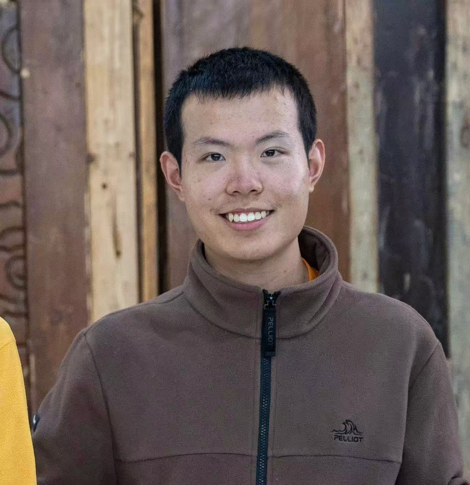

---
## Faculty  

  

    
     <figcaption><a href="https://physics.illinois.edu/people/directory/profile/tsokaros">Antonios Tsokaros</a> </figcaption>
  
&nbsp;&nbsp;
  

    
     <figcaption><a href="https://physics.illinois.edu/people/directory/profile/slshapir">Stuart L. Shapiro</a> </figcaption>
  

---
## Postdocs

  

    
     <figcaption>Jamie Bamber </figcaption>
  

---
## Graduate Students

  

    
     <figcaption>Maxwell Rizzo </figcaption>
  
&nbsp;&nbsp;
  

     
     <figcaption>Mai Li </figcaption>
  
&nbsp;&nbsp;
  

     
     <figcaption>Zixiang Meng </figcaption>
<!---  
&nbsp;&nbsp;
 

    
     <figcaption>Sumant Vyaghrambare</figcaption>   --->
  

---
## Undergraduate Students

<!---

  

    
     <figcaption><a href="https://aeric-underscore.github.io/">Eric Yu</a> </figcaption>
  
&nbsp;&nbsp;
  

    
     <figcaption>Jonah Doppelt </figcaption>
  
&nbsp;&nbsp;
  

    
     <figcaption>Nawaf Aldrees </figcaption>
  

    
     <figcaption><a href="https://sjammi2.github.io/">Shreyas Jammi</a> </figcaption>
  
&nbsp;&nbsp;
  

    
     <figcaption>Rohan Narasimhan </figcaption>
  
&nbsp;&nbsp;
  

    
     <figcaption>Gene Yun </figcaption>
  
&nbsp;&nbsp;
  

   --->

  

     
     <figcaption>Yinuan Liang </figcaption>
  
&nbsp;&nbsp;
  

     
     <figcaption>Taige Chen </figcaption>
  
&nbsp;&nbsp;
  

    
     <figcaption>Cody Olson</figcaption>
  

  

    
     <figcaption>Yuheng Guo</figcaption>
  
&nbsp;&nbsp;
  

    
     <figcaption>Seyed Ahmad Dastgheib </figcaption>
  
&nbsp;&nbsp;
  

    
     <figcaption>Jiahe Jin </figcaption>
  

 

  

     
     <figcaption>Xiaoan Zhao </figcaption>
  
&nbsp;&nbsp;
  

    
     <figcaption>Zihao Wang </figcaption>
  

 

---
## Alumni
**Undergraduates**
- [Mit Kotak](https://mitkotak.github.io/) (2021-2023) Now CSE PhD at MIT
- [Eric Yu](https://aeric-underscore.github.io) (2021-2024) PhD UC Berkeley
- Jonah Doppelt (2021-2024)
- Nawaf Aldrees (2021-2024)
- Shreyas Jammi
- Rohan Narasimhan
- Gene Yun

